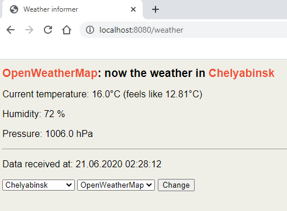

# Weather Informer

This is my practice project on Java. It is based on Spring framework, Maven etc.
Application represents a simple web form in which You may select weather service - **[OpenWeatherMap](https://openweathermap.org)**
or **[GridForeCast](https://gridforecast.com)** - and a city, for which weather will be requested. Per now these are three towns:
Chelyabinsk, Sankt Peterburg and Moscow (for a demo purpose). After submitting the form a current weather data will be
received from the service and displayed on the page:

If any errors will happen it will be displayed in a special block.

[UPD] A **GridForeCast** service has finished to provide a free keys. So this service will be now only for error demo. 